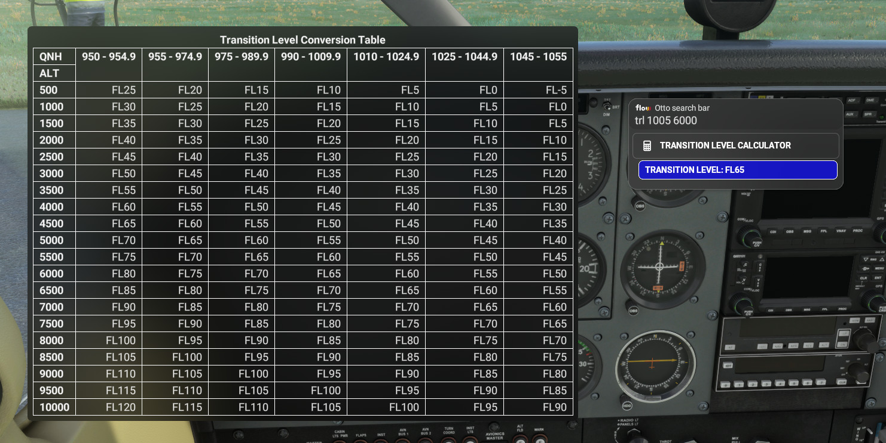

# Flow Transition Level Calculator

Flow widget to calculate Transition Levels based on local QNH and Transition Altitude

Clicking the Tile will open a conversion table, based off this one:  
https://ops.skeyes.be/html/belgocontrol_static/eaip/eAIP_Main/pdf/EB_ENR_1_7_en.pdf

There's also an Otto command where you can enter your own values, with an optional Transition Layer that is added ontop of the Transition Altitude:  
`trl <qnh> <transition altitude> [transition layer]`

For example:  
`trl 1023 4500`

or:  
`trl 1002 5000 1000`

